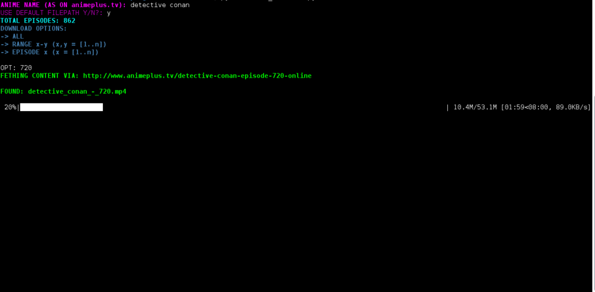
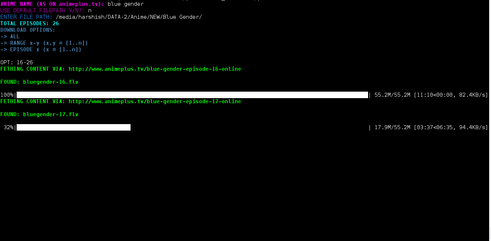

# Anime Downloader

Ever wanted to download anime without clickbaits and all at a go without using torrents? Anime Downloader uses  web scraping to directly download anime from [Animeplus](http://www.animeplus.tv/).

Used [Requests](http://docs.python-requests.org/en/master/), [BeautifulSoup](https://www.crummy.com/software/BeautifulSoup/bs4/doc/), [Mechanize](http://wwwsearch.sourceforge.net/mechanize/documentation.html), [tqdm](https://pypi.python.org/pypi/tqdm) and [termcolor](https://pypi.python.org/pypi/termcolor)

### Requirements :
+ BeautifulSoup
+ Requests
+ Mechanize
+ tqdm
+ termcolor

### Instructions :

```bash
# Clone this repository
git clone https://github.com/Harshish/Anime-Downloader.git

# Go into the repository
cd Anime-Downloader

# Install dependencies
[sudo] pip install -r requirements.txt

# Run the app
python anime_download.py

#Enter the anime of preference when prompted.
```

### Screenshots :

When browsed for python, some of the results are as shown below.





### TODOs :
+ Make compatible for movies too.
+ Add more downloadable anime sites.
+ Create GUI.
+ Video format and Quality preference

### Contributing :
+ Fork the repo.
+ Create a new branch named `<your_feature>`
+ Commit changes and make a PR.
+ PRs are welcome.
